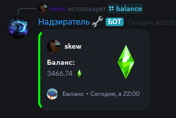

# Shadow Dragons multi-functional Bot

---

---
All commands
- [/balance - Show user balance](./img/balance.png)

- [/top - Show top user for type in `TopEnum` class](./img/top.png)
- [/pay - Pay rumbiks](./img/pay.png)
- [/rps - Rock-Paper-Scissors](./img/rps.png)
- [/warn](./img/warn.png)
- [/warns - Show your or member warns](./img/warns.png)
- [/user-info - Show your info or member info](./img/userinfo.png)
---
# installation

1. clone the repository:

    `git clone https://github.com/ida64pro/discordbotSD.git`

    `cd discordbotSD`

2. install the dependencies: `pip install`

3. Create DataBase mongodb 

4. Connect for bot

5. Insert your bot token from discord developer

6. run the bot: `python main.py`

---
